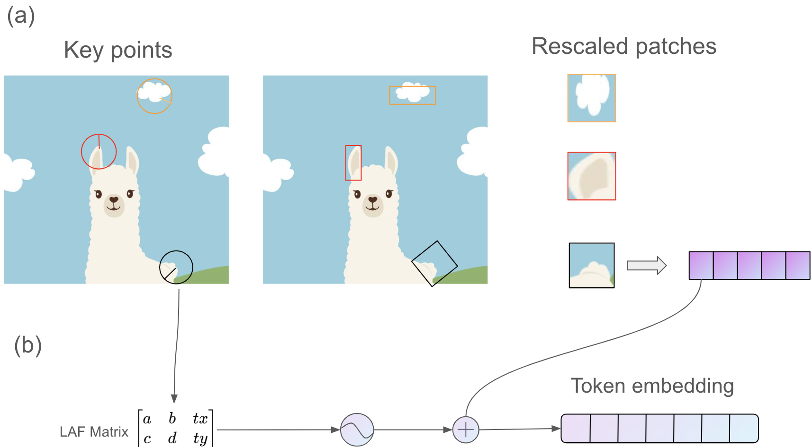

# EC523Proj

This repository is for the BU EC523 Project Fall 2024, where implement a Lafs(local affine frames)-based Transformer for image classification. Here we guide tokenization/patching with KeyNet as the local feature detection algorithm. These patches are featurized according to their size, orientation, and position. The following figure is a process illustration.

# Dataset
The dataset used is ImageNet_100, which has 1300 colored training images for each class with 100 classes in total. The validation set contains 50 images for each class.  

# How to Use
Note that the follwing training files are supposed to run on SCC with the access to the directory: '/projectnb/ec523kb/projects/teams_Fall_2024/Team_3', which is the location of the datasets (ImageNet_100, '/hg_cache/', and corresponding lafs, '/data/'). 
## Lafs Generation
Run 'main/lafs/add_laf.py' file to generate the lafs for each image in the ImageNet_100 datasets. 

## Lafs-based Vision Transformer
Run 'main/training/train_vit_with_laf.py' file to train the local affine frame-based ViT Transformer model. 
Run 'main/training/train_vit(baseline).py' file to train the ViT Transformer model for comparison. 

# Content
## KeyNet
First get patches from all images in the dataset using the `get_patch_and_feature.py` script. This will output a list of tokens, where each row *i* is an image with variable number of patches. Each patch (token[i][j]) is represented as a tensor.

lafs are used in computer vision for describing and working with local features. They represent the local geometric structure around a keypoint, capturing the scale, orientation, and local affine properties. This makes LAFs robust for tasks like image matching, transformation, and feature detection under varying conditions such as scaling, rotation, and perspective distortions.
## Laf-based Vision Transformer

